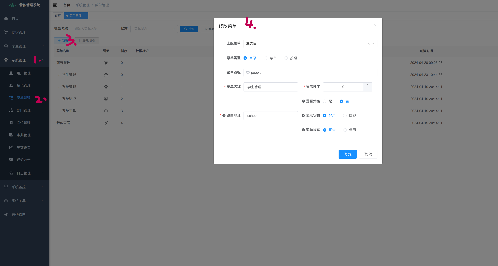
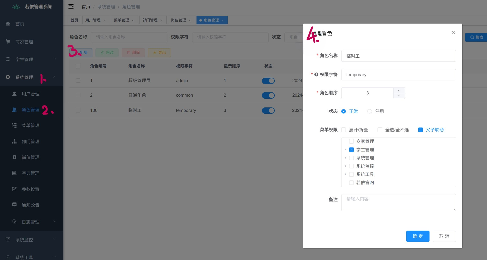
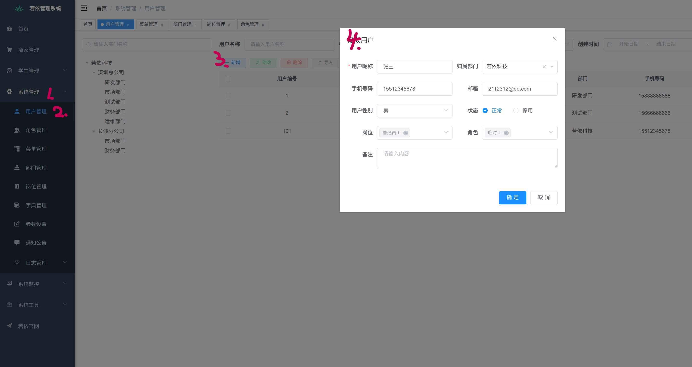

## 如何给用户分配权限

#### 假如你想新增一个学生管理的模块，然后想要指定只有某一些人才可以操作这个模块。

1. 首先你要先创建处这个模块,如下图（因为在测试时我创建完了，图片中展示的是点击修改后的样式，你点击新增就可以）
   （1）菜单类型: 目录代表着最左侧的导航栏。
   &emsp;&emsp;&emsp;&emsp;&emsp;&emsp;&emsp;菜单代表点击导航栏后会展示的东西。
   &emsp;&emsp;&emsp;&emsp;&emsp;&emsp;&emsp;按钮代表点击菜单栏后会展示的具体功能。
   （2）是否用外链：默认选择否。外链代表点击后是否跳转到外部链接。
   （3）显示顺序代表，其在导航栏的展示顺序。

   

2. 然后再去创建有权限去执行这个模块的角色。
   **请注意！！！**
   在第四步中，你要在这个下拉框里勾选出你新建的这个角色所拥有的权限。
   （1）权限字符可自定义
   （2）角色顺序代表当你点击角色管理时候的展示顺序。
   （3）默认父子联动，代表选择一个权限后就有其所有的功能。
   

3. 接着再去创建个新用户。
   **请注意！！！**
   （1）填写好用户的信息后，角色填写是至关重要的，这个就对应着这个用户所可以拥有的权限。这个角色是可以多选的。
   （2）岗位对于权限管理没有意义，只是为了对用户做区分。
   

4. 在用你创建好的用户重新登录测试一下。
   可以看到重新登录后的导航栏里只有这个用户所拥有权限的展示列表。
   
